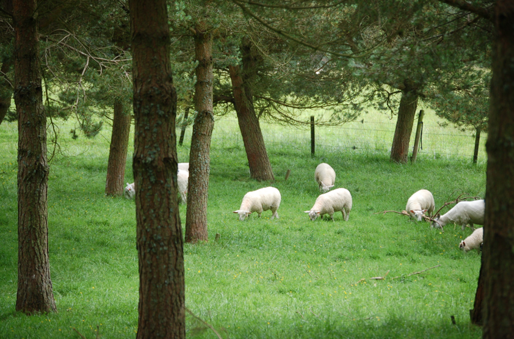
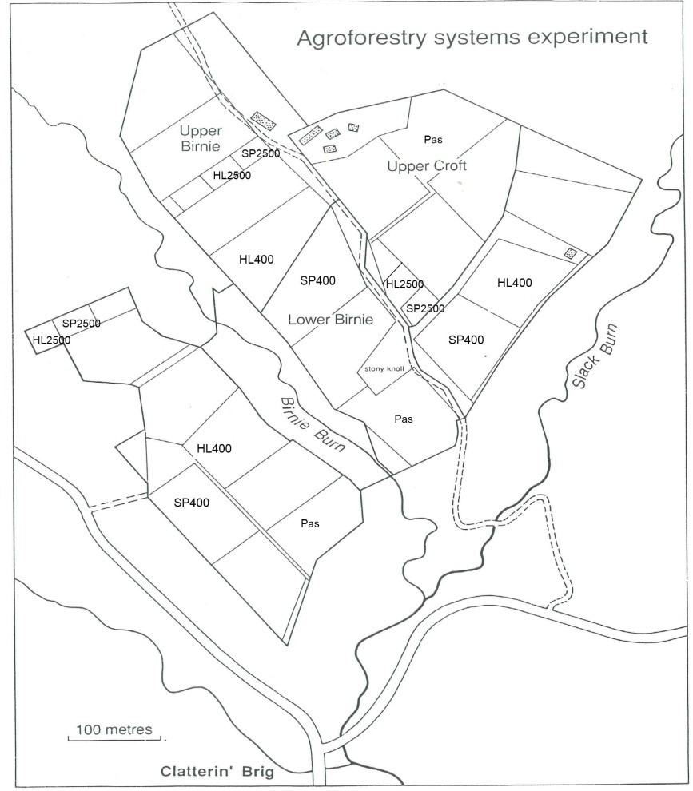

# Introduction
Quantifying carbon stocks and understanding the ability of different land use systems to sequester carbon is crucial for sustainable development and climate change mitigation. Silvopastoral systems can potentially store more carbon than forest and pasture ecosystems. This was tested by quantifying above and belowground tree carbon using allometric equations, litter layer and soil organic carbon (SOC) in the A horizon (0-30cm) and B horizon (30-50 cm) in a Hybrid Larch (Larix eurolepis) and Scots Pine (Pinus sylvestris) silvopasoral system in Northeast Scotland in comparison with woodland plots and pure pasture.

# Methods

### Site description

Glensaugh is a >1100 ha large research station owned by the James Hutton Institute circa 35 miles southwest of Aberdeen. The agroforestry experiment was established in spring 1988 mainly to investigate the impacts of Silvopasture on sheep and wood output. The site entails three tree species, namely Scots Pine (Pinus sylvestris), Hybrid Larch (Larix eurolepis)
and Sycamore (Acer pseudoplantanus) at densities of 100, 200 and 400 trees/ha. Also woodland control plots at densities of 2500 trees/ha and pasture control plots without trees were established. The Scots Pine and pasture plots are covered with rye grass (Lolium perenne) pasture and are grazed by varying numbers of sheep and cattle. In the Hybrid Larch silvopasture plots the originally planted grass has been covered in a dense litter layer, but the plots are still dwelled by sheep for shelter.

The silvopastoral and pasture control plots are 0.8 ha in size and the woodland plots 0.25ha.
In this study only the Scots Pine and Hybrid Larch at 400 (silvopasture) and 2500 (woodland) trees/ha density and the pasture control plots were sampled.  Each plot is replicated three times at three neighbouring locations; Croft, Birnie and Redstones.

### Tree biomass carbon estimation

In each plot 60 trees (which equals roughly a quarter of the total stocking) were randomly selected using a random number generator and the diameter at breast height, 1.3m (DBH) measured. The carbon stock was estimated using allometric equations which relate tree biomass to the Diameter at breast height (DBH).  

### Soil and organic layer samples

Soil pits were dug at three locations per plot. The locations were randomly selected using a random number generator. At the agroforestry and woodland treatments, the pits were dug in the middle of a quadrate of four trees, which led to a distance of ca. 1 metre in the 2500 trees/ha (woodland) and 3 metre in the 400 trees/ha (silvopasture) treatments respectively.
Soil samples for carbon analysis were taken in both the A and the B horizon. Bulk density cores were taken in the middle of each sampling layer. The sample for carbon analysis was taken from the whole range of the sampling depth. All bulk samples for carbon analysis were dried at 40⁰C until dry in the oven.
